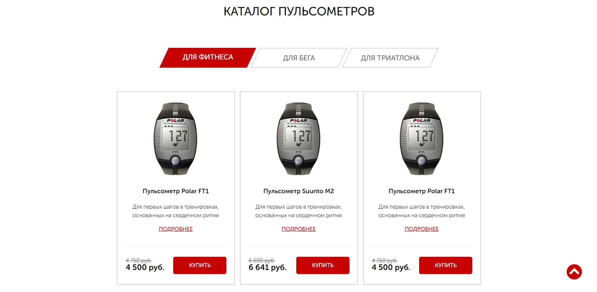
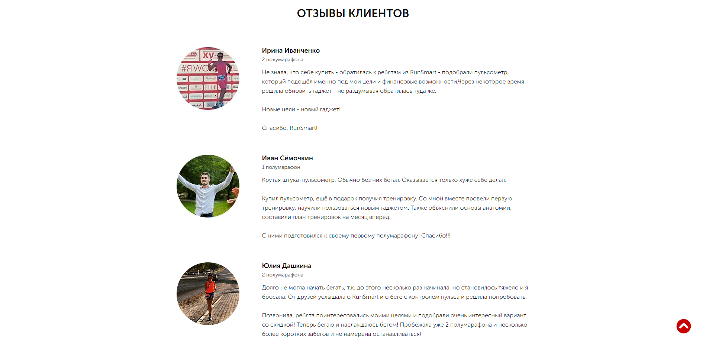

# [Pulse](https://mkaell.github.io/Pulse/dist/)

### _Technologies used:_ 
- **jQuery** is used.
- **BEM** and the **Sass** preprocessor are used.
- The slider is written using **Slick**.
- **WOW** JavaScript plugin is used to add animation
- **Gulp** was used to build the project.
-  There is an adaptation for all devices.

### Dependencies used:
```
-"browser-sync": "^2.27.3",
-"gulp": "^4.0.2",
-"gulp-autoprefixer": "^8.0.0",
-"gulp-clean-css": "^4.3.0",
-"gulp-cli": "^2.3.0",
-"gulp-htmlmin": "^5.0.1",
-"gulp-imagemin": "^7.1.0",
-"gulp-rename": "^2.0.0",
-"gulp-sass": "^5.0.0"
```

## Installation

Install all the necessary packages from package.json

```bash
npm install
```

Launching

```bash
gulp
```

<div align="center">
  
  
  
  
</div>
